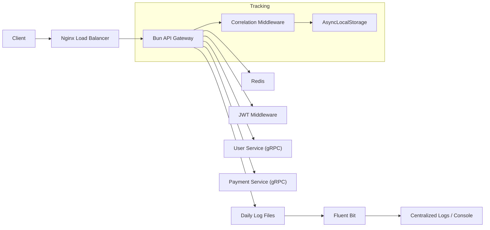

# High-Performance API Gateway

A modular, production-ready API Gateway built with **Bun**, **Nginx**, and **Redis**. It handles versioned routing, JWT authentication, distributed correlation tracking, and dual-level rate limiting, proxying requests to downstream microservices via **gRPC**.

## Features

- **High Performance**: Built on [Bun](https://bun.sh), a fast all-in-one JavaScript runtime.
- **Distributed Correlation Tracking**: 
    - **Unique IDs**: Ultra-random, shuffled alphanumeric IDs (Timestamp + PID + UUID + Shuffle) assigned to every request.
    - **Monotonic Sequencing**: Every log in a request lifecycle is tagged with a sequential suffix (e.g., `-1`, `-2`, `-3`) for perfect event ordering.
    - **Context Propagation**: Uses `AsyncLocalStorage` to propagate tracking IDs across all middleware and logs without manual passing.
- **Load Balancing**: Nginx configured as a reverse proxy and load balancer.
- **Redis Stack**: Enhanced with Redis-backed sliding window rate limiter and **Redis Insight**.
    - **Authenticated**: Higher limits for logged-in users (ID-based).
    - **Anonymous**: Stricter limits for guests (IP-based).
- **Centralized Logging**: Daily rotating JSON logs via **Winston** collected by **Fluent Bit**.
- **Performance Monitoring**: Automatic tracking of request duration (`durationMs`), start/end times, and target services.
- **gRPC Clients**: Uses `@connectrpc/connect` to talk to downstream services.
- **JWT Authentication**: Secure Bearer token verification with support for **Public Routes**.

## Architecture



## Observability & Logging

Every request is assigned a `x-correlation-id` and its performance is tracked. You can see this in both response headers and logs.

### Log Format (JSON)
```json
{
  "correlationId": "MNY1X7A2B9C3D4E5F-3",
  "level": "info",
  "message": "Request Completed: GET /api/v1/user/123 [user] - 200 (15ms)",
  "metadata": {
    "service": "user",
    "ip": "1.2.3.4",
    "status": 200,
    "durationMs": 15,
    "startTime": "2026-02-06T00:00:00.000Z"
  },
  "timestamp": "2026-02-06 02:00:00"
}
```

## API Endpoints

The gateway listens on port `80` (via Nginx) or `3000` (direct Bun).

### User Service (`/api/v1/user`)

| Method | Endpoint      | Description        | Auth Required |
| :----- | :------------ | :----------------- | :------------ |
| GET    | `/api/v1/user/:id` | Get user details   | Yes           |
| POST   | `/api/v1/user`     | **Registration**   | **No (Public)** |

### Payment Service (`/api/v1/payment`)

| Method | Endpoint           | Description            | Auth Required |
| :----- | :----------------- | :--------------------- | :------------ |
| GET    | `/api/v1/payment/:id` | Get transaction details| Yes           |
| POST   | `/api/v1/payment`     | Process a payment      | Yes           |

## Dashboard & Monitoring

- **Redis Insight**: Accessible at [http://localhost:8001](http://localhost:8001).
- **Fluent Bit Logs**: View centralized, parsed logs via:
  ```bash
  make docker-logs
  ```

## Directory Structure

```
/api-gateway
├── /infra                      # Infrastructure (Nginx, Fluent Bit)
│   ├── /nginx
│   └── /fluent-bit             # JSON Parsers & Config
├── /src
│   ├── /core                   # Core modules (Redis)
│   ├── /logger                 # Monotonic Rotating Logger
│   ├── /client                 # gRPC Client Wrappers
│   ├── /routes                 # Domain Routes
│   ├── /middleware             # Auth, Rate Limit, Correlation
│   ├── config.js               # Centralized Configuration
│   └── index.js                # Entry Point (Middleware setup)
```

