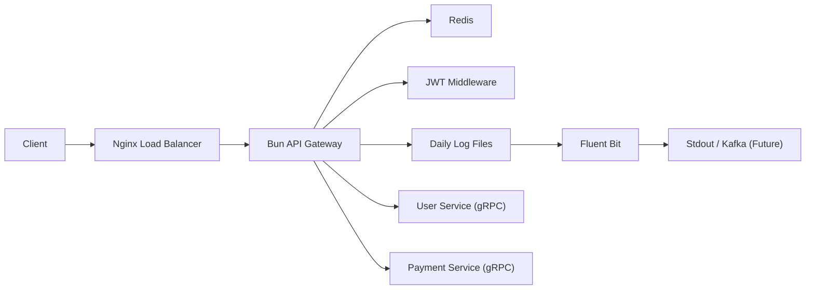

# High-Performance API Gateway

A modular, production-ready API Gateway built with **Bun**, **Nginx**, and **Redis**. It handles versioned routing, JWT authentication, and dual-level rate limiting, proxying requests to downstream microservices via **gRPC**.

## Features

- **High Performance**: Built on [Bun](https://bun.sh), a fast all-in-one JavaScript runtime.
- **Load Balancing**: Nginx configured as a reverse proxy and load balancer.
- **Redis Stack**: Enhanced with Redis-backed sliding window rate limiter and **Redis Insight**.
    - **Authenticated**: Higher limits for logged-in users (ID-based).
    - **Anonymous**: Stricter limits for guests (IP-based).
    - **Visualization**: Built-in **Redis Insight** for monitoring.
- **Centralized Logging**: Daily rotating JSON logs via **Winston** collected by **Fluent Bit**.
- **gRPC Clients**: Uses `@connectrpc/connect` to talk to downstream services (stubs provided).
- **Centralized Config**: Simplified environment management via `src/config.js`.
- **JWT Authentication**: Secure Bearer token verification.
- **Modular Architecture**: Domain-driven route separation (`user`, `payment`).

## Architecture



## Prerequisites

- [Docker](https://www.docker.com/) & Docker Compose

## Getting Started

1.  **Clone the repository**
2.  **Configure Environment**
    Copy the example or create a `.env` file in the `api-gateway` directory:
    ```env
    PORT=3000
    REDIS_HOST=redis
    REDIS_PORT=6379
    REDIS_INSIGHTS_PORT=8001
    SERVICE_ADDR_USER=http://user-service:3001
    SERVICE_ADDR_PAYMENT=http://payment-service:3002
    JWT_SECRET=supersecretkey
    RATE_LIMIT_WINDOW=60
    RATE_LIMIT_MAX=100
    RATE_LIMIT_AUTH_MAX=500
    ```
4.  **Run with Docker Compose**
    ```bash
    docker compose up --build
    ```

## Dashboard & Monitoring

- **Redis Insight**: Accessible at [http://localhost:8001](http://localhost:8001).
- **Fluent Bit Logs**: Centralized logs can be viewed via `docker logs gateway-fluent-bit`.
- **Local Logs**: Daily rotating log files are stored in the `./logs` directory.

## API Endpoints

The gateway listens on port `80` (via Nginx) or `3000` (direct Bun).

### User Service (`/api/v1/user`)

| Method | Endpoint      | Description        | Auth Required |
| :----- | :------------ | :----------------- | :------------ |
| GET    | `/api/v1/user/:id` | Get user details   | Yes           |
| POST   | `/api/v1/user`     | Create a new user  | Yes           |

### Payment Service (`/api/v1/payment`)

| Method | Endpoint           | Description            | Auth Required |
| :----- | :----------------- | :--------------------- | :------------ |
| GET    | `/api/v1/payment/:id` | Get transaction details| Yes           |
| POST   | `/api/v1/payment`     | Process a payment      | Yes           |

## Directory Structure

```
/api-gateway
├── /infra                      # Infrastructure (Nginx, Fluent Bit)
│   ├── /nginx
│   └── /fluent-bit
├── /proto                      # gRPC Protocol Buffers
├── /src
│   ├── /core                   # Core modules (Redis)
│   ├── /logger                 # Daily Rotating Logger
│   ├── /stubs                  # Generated gRPC stubs
│   ├── /client                 # gRPC Client Wrappers
│   ├── /routes                 # Domain Routes
│   ├── /middleware             # Auth & Rate Limiting
│   ├── config.js               # Centralized Configuration
│   └── index.js                # Entry Point
├── Dockerfile.bun              # Gateway Dockerfile
└── docker-compose.yml          # Orchestration
```
